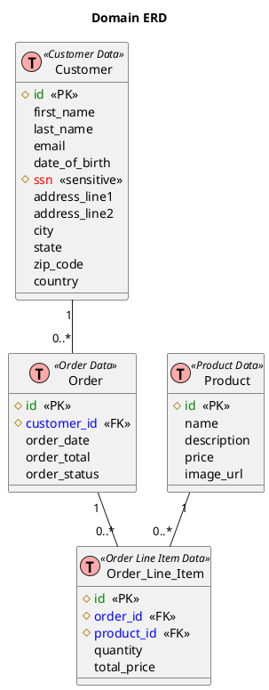

```plantuml
@startuml Domain ERD
title Domain ERD
!procedure Table(name,desc)
class name << (T,#FFAAAA) desc >>
!endprocedure

!procedure sensitive(x)
# <color:#Red>x </color> << sensitive >>
!endprocedure

!procedure primary_key(x)
# <color:#Green>x </color> << PK >>
!endprocedure

!procedure foreign_key(x)
# <color:#Blue>x </color> << FK >>
!endprocedure

' -- Entities

Table("Customer", "Customer Data") {
    primary_key(id)
    first_name
    last_name
    email
    date_of_birth
    sensitive(ssn)
    address_line1
    address_line2
    city
    state
    zip_code
    country
}
Table("Order", "Order Data") {
    primary_key(id)
    foreign_key(customer_id)
    order_date
    order_total
    order_status
}
Table("Product", "Product Data") {
    primary_key(id)
    name
    description
    price
    image_url
}
Table("Order_Line_Item", "Order Line Item Data") {
    primary_key(id)
    foreign_key(order_id)
    foreign_key(product_id)
    quantity
    total_price
}

' -- Relationships

Customer "1" -- "0..*" Order
Order "1" -- "0..*" Order_Line_Item
Product "1" -- "0..*" Order_Line_Item
@enduml
``` 
