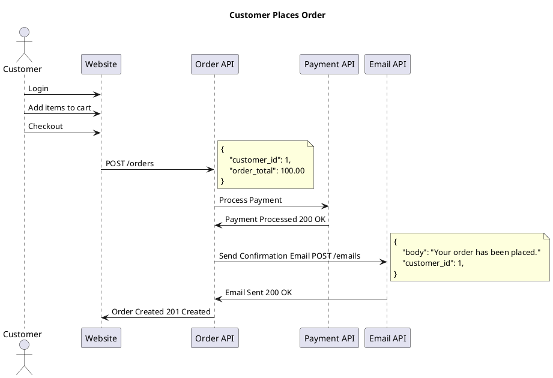

```plantuml
@startuml Customer Places Order
title Customer Places Order
actor Customer
participant Website
participant OrderAPI as "Order API"
participant PaymentAPI as "Payment API"
participant EmailAPI as "Email API"

Customer -> Website: Login 
Customer -> Website: Add items to cart
Customer -> Website: Checkout
Website -> OrderAPI: POST /orders
note right
{
    "customer_id": 1,
    "order_total": 100.00
}
end note
OrderAPI -> PaymentAPI: Process Payment
PaymentAPI -> OrderAPI: Payment Processed 200 OK
OrderAPI -> EmailAPI: Send Confirmation Email POST /emails
note right
{
    "body": "Your order has been placed."
    "customer_id": 1,
}
end note
EmailAPI -> OrderAPI: Email Sent 200 OK
OrderAPI -> Website: Order Created 201 Created

@enduml
```
