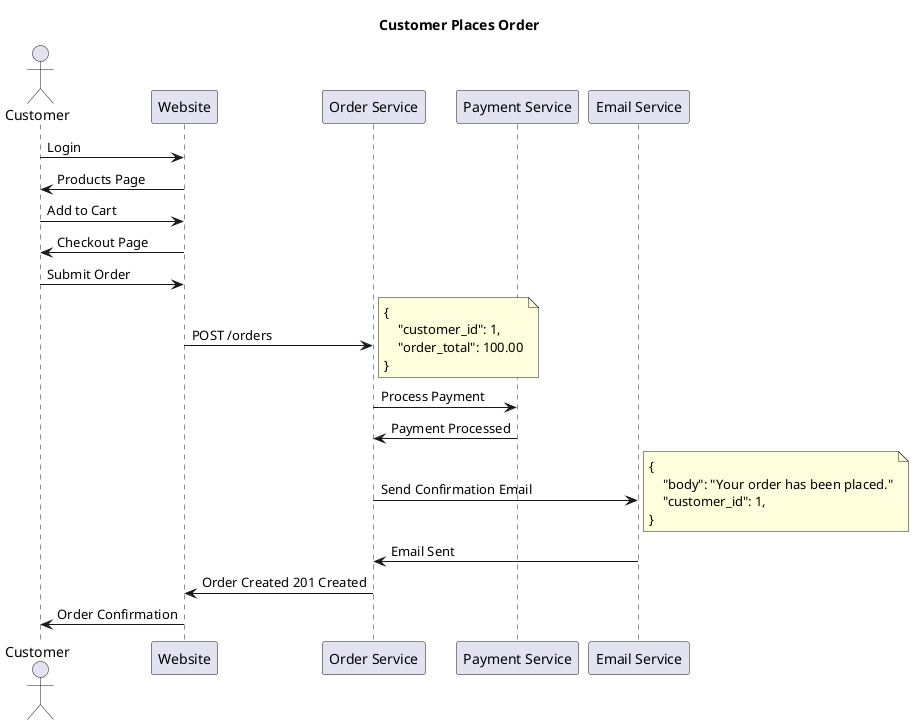

```plantuml
@startuml Customer Places Order
title Customer Places Order
actor Customer
participant Website
participant OrderService as "Order Service"
participant PaymentService as "Payment Service"
participant EmailService as "Email Service"

Customer -> Website: Login
Website -> Customer: Products Page
Customer -> Website: Add to Cart
Website -> Customer: Checkout Page
Customer -> Website: Submit Order
Website -> OrderService: POST /orders 
note right
{
    "customer_id": 1,
    "order_total": 100.00
}
end note
OrderService -> PaymentService: Process Payment
PaymentService -> OrderService: Payment Processed
OrderService -> EmailService: Send Confirmation Email
note right
{
    "body": "Your order has been placed."
    "customer_id": 1,
}
end note
EmailService -> OrderService: Email Sent
OrderService -> Website: Order Created 201 Created
Website -> Customer: Order Confirmation

@enduml
```
