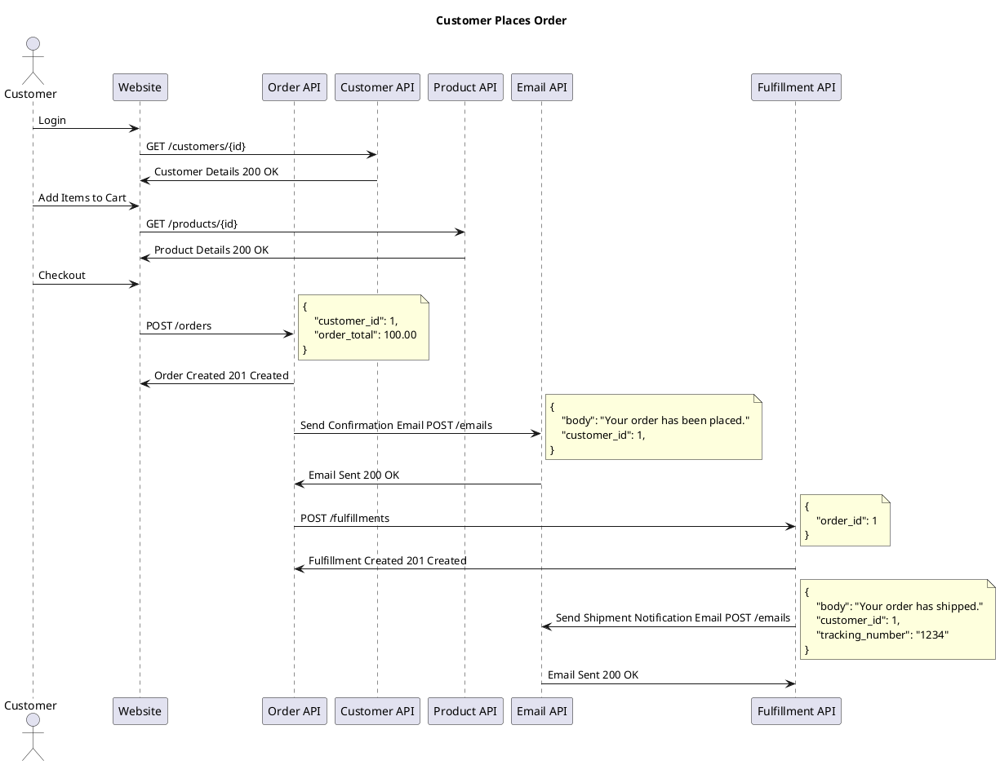

```plantuml
@startuml Customer Places Order
title Customer Places Order
actor Customer
participant Website
participant OrderAPI as "Order API"
participant CustomerAPI as "Customer API"
participant ProductAPI as "Product API"
participant EmailAPI as "Email API"
participant FulfillmentAPI as "Fulfillment API"

Customer -> Website: Login
Website -> CustomerAPI: GET /customers/{id}
CustomerAPI -> Website: Customer Details 200 OK

Customer -> Website: Add Items to Cart
Website -> ProductAPI: GET /products/{id}
ProductAPI -> Website: Product Details 200 OK

Customer -> Website: Checkout
Website -> OrderAPI: POST /orders
note right
{
    "customer_id": 1,
    "order_total": 100.00
}
end note
OrderAPI -> Website: Order Created 201 Created

OrderAPI -> EmailAPI: Send Confirmation Email POST /emails
note right
{
    "body": "Your order has been placed."
    "customer_id": 1,
}
end note
EmailAPI -> OrderAPI: Email Sent 200 OK

OrderAPI -> FulfillmentAPI: POST /fulfillments
note right
{
    "order_id": 1
}
end note
FulfillmentAPI -> OrderAPI: Fulfillment Created 201 Created

FulfillmentAPI -> EmailAPI: Send Shipment Notification Email POST /emails
note right
{
    "body": "Your order has shipped."
    "customer_id": 1,
    "tracking_number": "1234" 
}
end note
EmailAPI -> FulfillmentAPI: Email Sent 200 OK

@enduml
```
