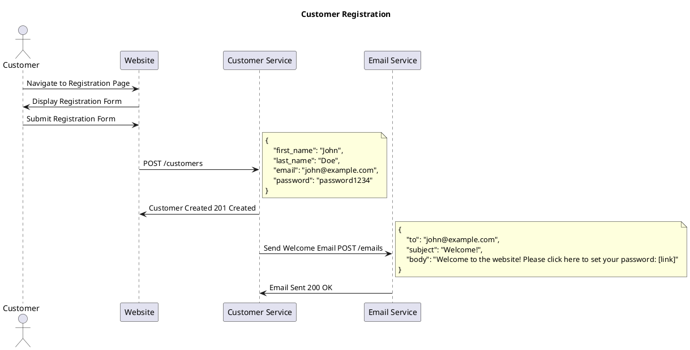

```plantuml
@startuml Customer Registration
title Customer Registration
actor Customer
participant Website
participant CustomerService as "Customer Service" 
participant EmailService as "Email Service"

Customer -> Website: Navigate to Registration Page
Website -> Customer: Display Registration Form
Customer -> Website: Submit Registration Form
Website -> CustomerService: POST /customers
note right
{
    "first_name": "John",
    "last_name": "Doe",
    "email": "john@example.com",
    "password": "password1234" 
}
end note
CustomerService -> Website: Customer Created 201 Created
CustomerService -> EmailService: Send Welcome Email POST /emails
note right
{
    "to": "john@example.com",
    "subject": "Welcome!",
    "body": "Welcome to the website! Please click here to set your password: [link]"
}
end note
EmailService -> CustomerService: Email Sent 200 OK

@enduml
```
