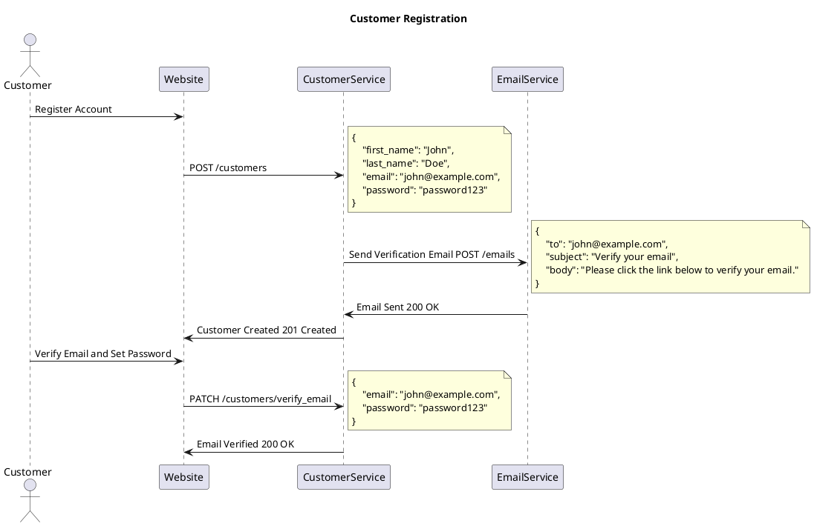

```plantuml
@startuml Customer Registration
title Customer Registration
actor Customer
participant Website
participant CustomerService
participant EmailService

Customer -> Website: Register Account
Website -> CustomerService: POST /customers
note right
{
    "first_name": "John",
    "last_name": "Doe",
    "email": "john@example.com",
    "password": "password123"
}
end note
CustomerService -> EmailService: Send Verification Email POST /emails
note right
{
    "to": "john@example.com",
    "subject": "Verify your email",
    "body": "Please click the link below to verify your email."
}
end note
EmailService -> CustomerService: Email Sent 200 OK
CustomerService -> Website: Customer Created 201 Created

Customer -> Website: Verify Email and Set Password
Website -> CustomerService: PATCH /customers/verify_email
note right
{
    "email": "john@example.com",
    "password": "password123" 
}
end note
CustomerService -> Website: Email Verified 200 OK

@enduml
```
