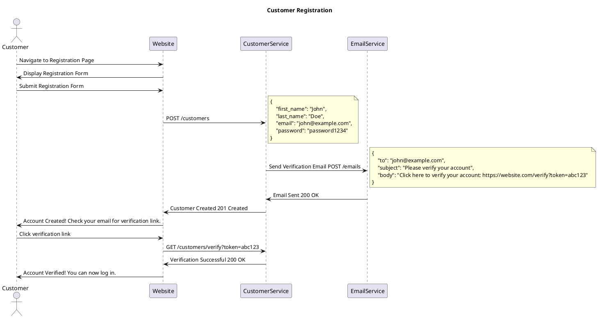

```plantuml
@startuml Customer Registration
title Customer Registration
actor Customer
participant Website
participant CustomerService
participant EmailService

Customer -> Website: Navigate to Registration Page
Website -> Customer: Display Registration Form
Customer -> Website: Submit Registration Form
Website -> CustomerService: POST /customers
note right
{
    "first_name": "John",
    "last_name": "Doe",
    "email": "john@example.com",
    "password": "password1234"
}
end note
CustomerService -> EmailService: Send Verification Email POST /emails
note right
{
    "to": "john@example.com",
    "subject": "Please verify your account",
    "body": "Click here to verify your account: https://website.com/verify?token=abc123" 
}
end note
EmailService -> CustomerService: Email Sent 200 OK
CustomerService -> Website: Customer Created 201 Created
Website -> Customer: Account Created! Check your email for verification link.

Customer -> Website: Click verification link
Website -> CustomerService: GET /customers/verify?token=abc123
CustomerService -> Website: Verification Successful 200 OK
Website -> Customer: Account Verified! You can now log in.

@enduml
```
