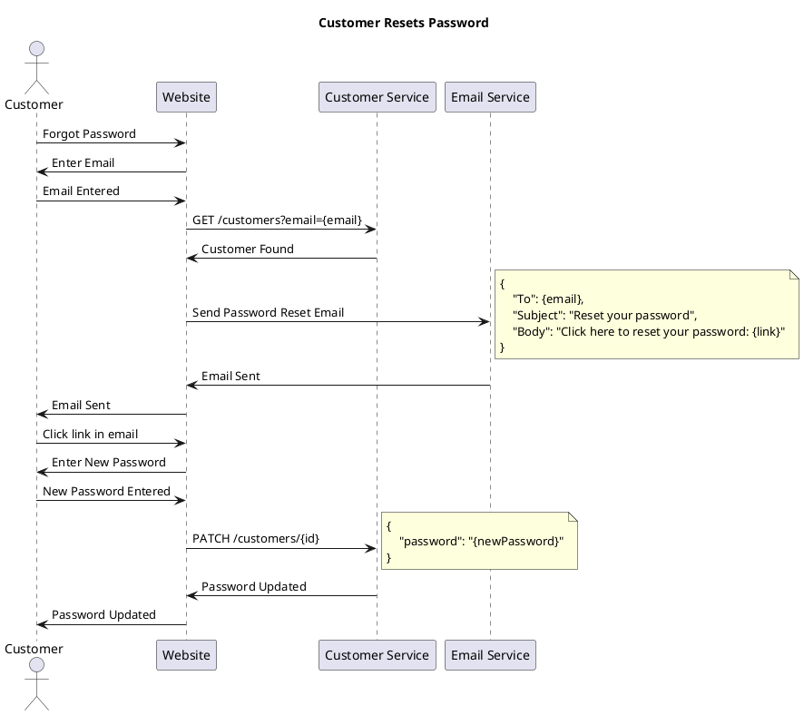

```plantuml
@startuml Customer Resets Password
title Customer Resets Password
actor Customer
participant Website
participant CustomerService as "Customer Service"
participant EmailService as "Email Service"

Customer -> Website: Forgot Password
Website -> Customer: Enter Email
Customer -> Website: Email Entered
Website -> CustomerService: GET /customers?email={email}
CustomerService -> Website: Customer Found
Website -> EmailService: Send Password Reset Email 
note right
{
    "To": {email},
    "Subject": "Reset your password",
    "Body": "Click here to reset your password: {link}"
} 
end note
EmailService -> Website: Email Sent
Website -> Customer: Email Sent

Customer -> Website: Click link in email
Website -> Customer: Enter New Password
Customer -> Website: New Password Entered
Website -> CustomerService: PATCH /customers/{id}
note right 
{
    "password": "{newPassword}"
}
end note
CustomerService -> Website: Password Updated
Website -> Customer: Password Updated

@enduml
```
