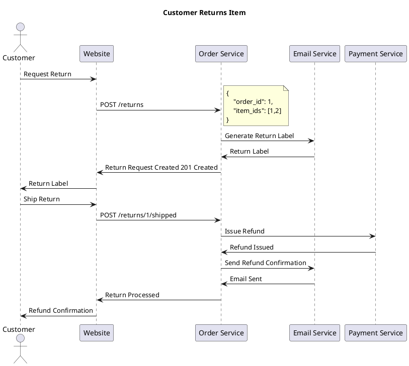

```plantuml
@startuml Customer Returns Item
title Customer Returns Item
actor Customer
participant Website
participant OrderService as "Order Service" 
participant EmailService as "Email Service"
participant PaymentService as "Payment Service"

Customer -> Website: Request Return
Website -> OrderService: POST /returns
note right
{
    "order_id": 1,
    "item_ids": [1,2]
}
end note
OrderService -> EmailService: Generate Return Label
EmailService -> OrderService: Return Label
OrderService -> Website: Return Request Created 201 Created
Website -> Customer: Return Label

Customer -> Website: Ship Return
Website -> OrderService: POST /returns/1/shipped
OrderService -> PaymentService: Issue Refund
PaymentService -> OrderService: Refund Issued
OrderService -> EmailService: Send Refund Confirmation
EmailService -> OrderService: Email Sent
OrderService -> Website: Return Processed
Website -> Customer: Refund Confirmation

@enduml
```
