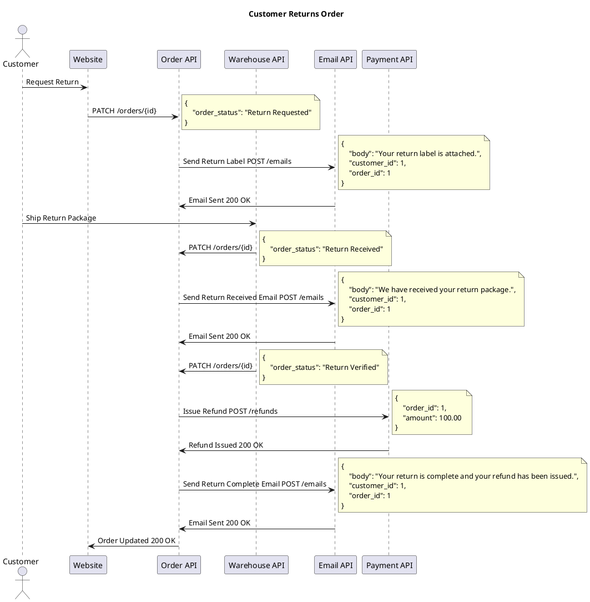

```plantuml
@startuml Customer Returns Order
title Customer Returns Order
actor Customer
participant Website
participant OrderAPI as "Order API"
participant WarehouseAPI as "Warehouse API"
participant EmailAPI as "Email API"
participant PaymentAPI as "Payment API"

Customer -> Website: Request Return
Website -> OrderAPI: PATCH /orders/{id}
note right
{
    "order_status": "Return Requested"
}
end note
OrderAPI -> EmailAPI: Send Return Label POST /emails
note right
{
    "body": "Your return label is attached.",
    "customer_id": 1,
    "order_id": 1
}
end note
EmailAPI -> OrderAPI: Email Sent 200 OK

Customer -> WarehouseAPI: Ship Return Package
WarehouseAPI -> OrderAPI: PATCH /orders/{id}
note right
{
    "order_status": "Return Received"
}
end note
OrderAPI -> EmailAPI: Send Return Received Email POST /emails
note right
{
    "body": "We have received your return package.",
    "customer_id": 1,
    "order_id": 1
}
end note
EmailAPI -> OrderAPI: Email Sent 200 OK

WarehouseAPI -> OrderAPI: PATCH /orders/{id}
note right
{
    "order_status": "Return Verified"
}
end note
OrderAPI -> PaymentAPI: Issue Refund POST /refunds
note right
{
    "order_id": 1,
    "amount": 100.00 
}
end note
PaymentAPI -> OrderAPI: Refund Issued 200 OK

OrderAPI -> EmailAPI: Send Return Complete Email POST /emails
note right
{
    "body": "Your return is complete and your refund has been issued.",
    "customer_id": 1,
    "order_id": 1
}
end note 
EmailAPI -> OrderAPI: Email Sent 200 OK

OrderAPI -> Website: Order Updated 200 OK

@enduml
```
