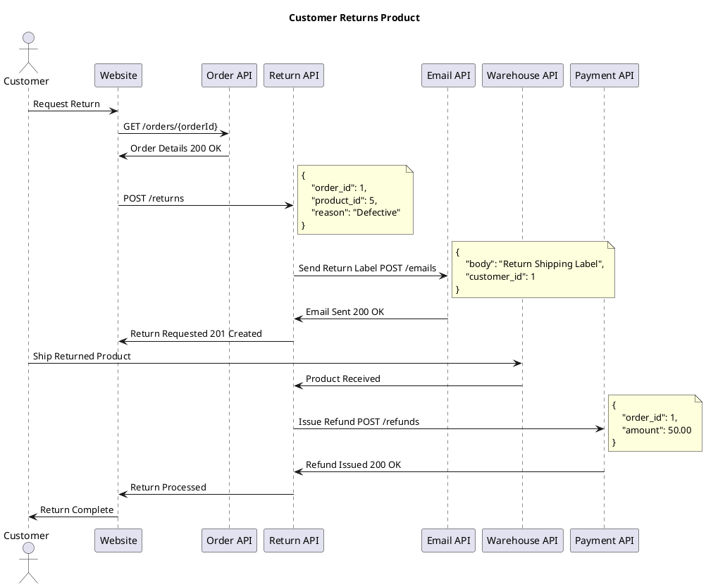

```plantuml
@startuml Customer Returns Product
title Customer Returns Product
actor Customer
participant Website
participant OrderAPI as "Order API"
participant ReturnAPI as "Return API"
participant EmailAPI as "Email API"
participant WarehouseAPI as "Warehouse API"
participant PaymentAPI as "Payment API"

Customer -> Website: Request Return
Website -> OrderAPI: GET /orders/{orderId}
OrderAPI -> Website: Order Details 200 OK
Website -> ReturnAPI: POST /returns
note right
{
    "order_id": 1,
    "product_id": 5,
    "reason": "Defective" 
}
end note
ReturnAPI -> EmailAPI: Send Return Label POST /emails
note right
{
    "body": "Return Shipping Label",
    "customer_id": 1
}
end note
EmailAPI -> ReturnAPI: Email Sent 200 OK
ReturnAPI -> Website: Return Requested 201 Created

Customer -> WarehouseAPI: Ship Returned Product
WarehouseAPI -> ReturnAPI: Product Received
ReturnAPI -> PaymentAPI: Issue Refund POST /refunds
note right 
{
    "order_id": 1,
    "amount": 50.00
}
end note
PaymentAPI -> ReturnAPI: Refund Issued 200 OK
ReturnAPI -> Website: Return Processed
Website -> Customer: Return Complete

@enduml
```
