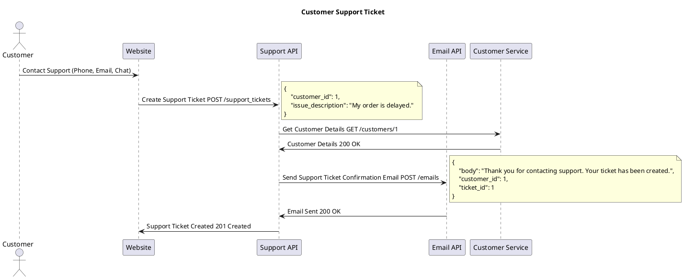

```plantuml
@startuml Customer Support Ticket
title Customer Support Ticket
actor Customer
participant Website
participant SupportAPI as "Support API"
participant EmailAPI as "Email API"
participant CustomerService as "Customer Service"

Customer -> Website: Contact Support (Phone, Email, Chat)
Website -> SupportAPI: Create Support Ticket POST /support_tickets
note right
{
    "customer_id": 1,
    "issue_description": "My order is delayed." 
}
end note
SupportAPI -> CustomerService: Get Customer Details GET /customers/1
CustomerService -> SupportAPI: Customer Details 200 OK
SupportAPI -> EmailAPI: Send Support Ticket Confirmation Email POST /emails
note right
{
    "body": "Thank you for contacting support. Your ticket has been created.",
    "customer_id": 1,
    "ticket_id": 1
}
end note
EmailAPI -> SupportAPI: Email Sent 200 OK
SupportAPI -> Website: Support Ticket Created 201 Created

@enduml
```
