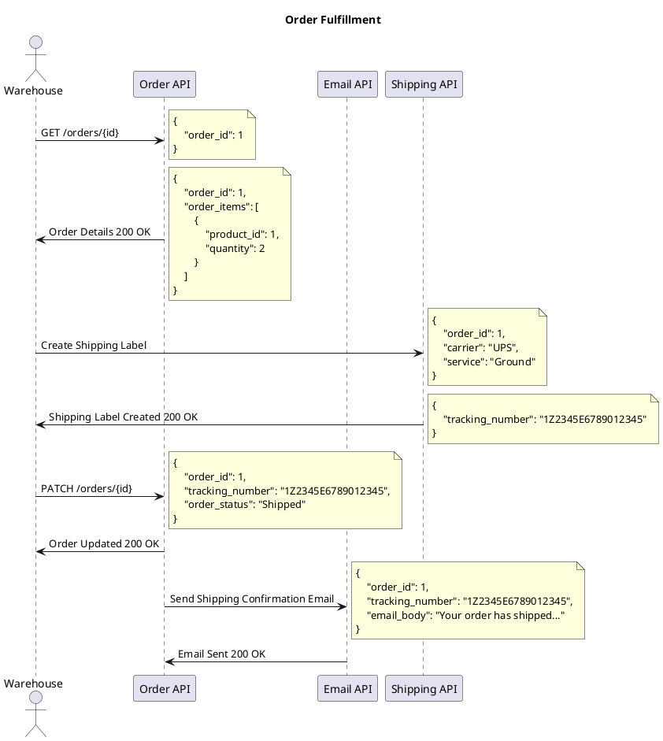

```plantuml
@startuml Order Fulfillment
title Order Fulfillment
actor Warehouse
participant OrderAPI as "Order API"
participant EmailAPI as "Email API"
participant ShippingAPI as "Shipping API"

Warehouse -> OrderAPI: GET /orders/{id}
note right
{
    "order_id": 1
}
end note
OrderAPI -> Warehouse: Order Details 200 OK
note right
{
    "order_id": 1,
    "order_items": [
        {
            "product_id": 1,
            "quantity": 2
        }
    ] 
}
end note

Warehouse -> ShippingAPI: Create Shipping Label
note right
{
    "order_id": 1,
    "carrier": "UPS",
    "service": "Ground"
}
end note
ShippingAPI -> Warehouse: Shipping Label Created 200 OK
note right
{
    "tracking_number": "1Z2345E6789012345"
}
end note

Warehouse -> OrderAPI: PATCH /orders/{id}
note right 
{
    "order_id": 1,
    "tracking_number": "1Z2345E6789012345",
    "order_status": "Shipped"
}
end note
OrderAPI -> Warehouse: Order Updated 200 OK

OrderAPI -> EmailAPI: Send Shipping Confirmation Email
note right
{
    "order_id": 1,
    "tracking_number": "1Z2345E6789012345",
    "email_body": "Your order has shipped..."
}
end note 
EmailAPI -> OrderAPI: Email Sent 200 OK

@enduml
```
